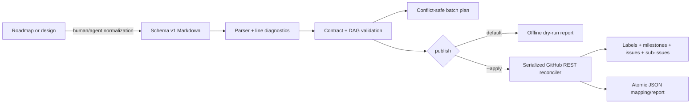

# plan-gh-backlog

Turn a large roadmap into a validated, dependency-aware GitHub issue backlog—without duplicating issues when titles change.

`plan-gh-backlog` is both an [Agent Skill](https://agentskills.io/) and a Python CLI. It parses a strict Markdown schema, reports line-level errors, previews bounded implementation batches, and publishes labels, milestones, epic/task issues, exact `#number` dependency links, epic checklists, and native GitHub sub-issues. GitHub writes are serialized and require explicit `--apply`.

## Exact usage

```bash
plan-gh-backlog validate BACKLOG.md
plan-gh-backlog plan BACKLOG.md --max-parallel 8
plan-gh-backlog plan BACKLOG.md --json
plan-gh-backlog publish BACKLOG.md --repo OWNER/REPO          # offline dry-run
plan-gh-backlog publish BACKLOG.md --repo OWNER/REPO --apply  # GitHub writes
```

Create an absent repository only when explicitly intended:

```bash
plan-gh-backlog publish BACKLOG.md --repo OWNER/REPO \
  --create-repo --visibility public --apply
```

## Why

Roadmaps usually mix outcomes, tasks, assumptions, and implied ordering. Publishing them directly causes broken dependencies, stale epic checklists, unsafe parallel work, and duplicates after title edits. This tool makes the contract explicit and validates it before any mutation.

Stable hidden markers, not titles, identify managed issues:

```html
<!-- plan-gh-backlog:id=E-01.1 -->
```

Human-written issue text outside the versioned managed block survives updates.

## Install

Requires Python 3.11+ and, for apply only, either `GH_TOKEN` or an authenticated [GitHub CLI](https://cli.github.com/).

### Clone and run directly

```bash
git clone https://github.com/blockedby/plan-gh-backlog.git
cd plan-gh-backlog
./scripts/plan-gh-backlog --help
```

### Install the Python CLI

```bash
python -m pip install .
plan-gh-backlog --help
```

### Use as an Agent Skill

Clone the repository into a discovered skill location, for example:

```bash
git clone https://github.com/blockedby/plan-gh-backlog.git \
  ~/.agents/skills/plan-gh-backlog
```

Pi also accepts the explicit path:

```bash
pi --skill /path/to/plan-gh-backlog/SKILL.md
```

Review skills before enabling them; `SKILL.md` keeps apply behind explicit authorization.

## A small text example

```markdown
# GitHub Backlog

- Version: 1
- Max parallel: 2

## Labels

- `type:epic` | `5319E7` | Managed epic
- `type:task` | `1D76DB` | Managed task

## Milestones

### Milestone `M1`: Foundation
- Due: none

#### Body

Ship a testable foundation.

## Epics

### Epic `E-01`: Identity
- Milestone: `M1`
- Wave: 1
- Area: identity
- Owner: platform-team
- Labels: `type:epic`
- Checklist:
  - [ ] `E-01.1` Define claims

#### Body

Establish identity contracts.

## Tasks

### Task `E-01.1`: Define claims
- Epic: `E-01`
- Milestone: `M1`
- Wave: 1
- Area: identity
- Owner: platform-team
- Dependencies: none
- Conflict group: identity-core
- Paths: `src/identity/`
- Labels: `type:task`

#### Body

Define accepted and emitted claims.
```

The complete example has two epics, cross-task dependencies, waves, path ownership, and conflict groups: [`examples/backlog.md`](examples/backlog.md). The exact grammar is in [`references/schema.md`](references/schema.md).

## Recommended workflow

1. **Normalize** prose into stable milestones, epics, and tasks. Record ambiguity rather than guessing.
2. **Validate** unique IDs, required fields, references, wave ordering, exact parent/checklist consistency, and DAG acyclicity.
3. **Plan** dependency-ready implementation batches. Review the JSON in automation.
4. **Dry-run** publication. This is offline and writes a local planned report.
5. **Apply** only after explicit approval.
6. **Rerun safely** after transient or partial failures; managed markers prevent duplicate issues.

```bash
cp examples/backlog.md BACKLOG.md
plan-gh-backlog validate BACKLOG.md
plan-gh-backlog plan BACKLOG.md --max-parallel 4
plan-gh-backlog publish BACKLOG.md --repo acme/service
cat .plan-gh-backlog-report.json
plan-gh-backlog publish BACKLOG.md --repo acme/service --apply
```

## Parallelism is planning, not execution

`plan` finishes lower waves first, then forms deterministic dependency-ready batches capped at `--max-parallel` (1–64). Tasks sharing a conflict group or overlapping owned path roots are separated. `area` and `owner` remain visible scheduling metadata.

GitHub publication itself is deliberately serialized and rate-safe. This CLI does **not** start or coordinate implementation agents.

## Architecture



The implementation uses only the Python standard library. Markdown is never evaluated or interpolated into a shell command.

## Safety and idempotency

- Validation runs before authentication or mutation.
- Dry-run makes no network requests.
- Issue identity comes from one stable hidden ID marker; edited titles do not create duplicates.
- Duplicate/conflicting remote markers and malformed managed blocks stop apply before backlog mutations.
- Only the delimited managed block is replaced; user body content outside it is preserved.
- Existing labels on managed issues are reconciled to the schema because they are managed fields.
- Pagination, primary/secondary rate limits, 429s, and transient 5xx responses have bounded retries/backoff.
- Operations are deterministic and serialized for safe partial reruns.
- Issues are never closed or deleted. There is no implicit pruning.
- The JSON report is atomically updated and contains IDs, issue numbers/URLs, statuses, and native sub-issue results—never credentials.

The default report, `.plan-gh-backlog-report.json`, is gitignored. Choose another path with `--report PATH`.

## GitHub permissions

Authenticate with either:

```bash
gh auth login
# or
export GH_TOKEN=...
```

For existing repositories, the credential needs repository metadata read and issues read/write (including labels and milestones). Repository creation additionally needs administration/create permission. Organization policy can restrict repository creation or native sub-issues. Tokens are never printed.

The publisher supports public or private existing repositories. `--create-repo` requires explicit `--apply`, `--visibility`, and `OWNER/REPO`; it does not change an existing repository's visibility.

## Schema and migration

- [Schema v1](references/schema.md)
- [Publishing/API behavior](references/publishing.md)
- [Free-form roadmap migration](references/migration.md)

There is intentionally no automatic prose converter. If source text does not specify boundaries, dependencies, owners, or paths, a converter would hallucinate operational structure. Normalize first and preserve unresolved questions separately.

## Limits and non-goals

- No implementation-agent execution.
- No arbitrary prose-to-task guessing.
- No closing, deleting, or pruning issues.
- No project boards, issue types, assignees, or custom project fields.
- No parallel GitHub writes.
- No live GitHub calls in automated tests.
- Native sub-issue publication depends on repository/account support in GitHub's REST API.

## Troubleshooting

**`error[reference]` or `error[checklist]`**

Fix the reported line. Every dependency, milestone, label, parent, and checklist task must exist; checklist titles must exactly match task titles.

**`error[future-dependency]` or `error[cycle]`**

Move the dependency to the same/earlier wave or correct the dependency graph. Do not suppress it.

**Remote managed-marker conflict**

Stop and inspect the referenced issue bodies. Keep one correct marker in one valid managed block per issue; do not guess which duplicate to delete.

**403/429 during apply**

The client retries recognized rate limits. If retries exhaust, inspect token permissions and GitHub's rate-limit response, then rerun; completed resources are discovered by marker.

**Native sub-issue failure**

Confirm repository policy and credential support. The progress report records earlier successful operations; rerun after correcting access.

## Development and tests

No third-party runtime or test dependency is required.

```bash
python -m unittest discover -s tests -v
python -m build  # optional packaging check; requires the `build` frontend
./scripts/plan-gh-backlog validate examples/backlog.md
./scripts/plan-gh-backlog plan examples/backlog.md --json
```

Tests use fake transports/clients; they never mutate GitHub. Contributions should preserve schema determinism, marker safety, offline dry-run behavior, and idempotent partial reruns.

## License

[MIT](LICENSE)
